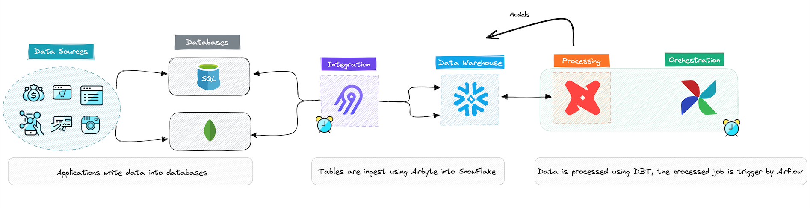

# Construindo Pipeline de dados com Modern Data Stack

### Getting Started

Confira abaixo, os passos para criar o seu ambiente local:

#### Passo 1

Vamos usar MongoDB como nossa fonte de dados e utilizar o MongoDB Atlas.

Veja como criar a conta no MongoDB Atlas:
* https://www.loom.com/share/63b8e4a44bea45a7a02f8ab7a4b1147d

Link do MongoDB: [Shared - ForeverFree]
* https://www.mongodb.com/cloud

#### Passo 2

Agora, vamos criar nossa conta no Airbyte Cloud:
* https://www.loom.com/share/49ec90a6656640478831e92d613c7faa

Link do Airbyte: [Trial]
* https://airbyte.com/

#### Passo 3

Depois de criada a parte de ingestão, vamos para o armazenamento no Snowflake:

Como criar a conta no Snowflake:
* https://www.loom.com/share/34384634f55f4e1984a92532df1458a2

Link do Snowflake: [Trial - Standard]
* https://www.snowflake.com/en/

#### Passo 4

DBT Cloud: veja abaixo como  criamos o DBT Cloud, uma das tecnologias mais interessantes:

Como criar uma conta no DBT Cloud:
* https://www.loom.com/share/6ab5925007084d9ea52640313a54521c

Link do DBT Cloud: [One Developer - ForeverFree]
* https://www.getdbt.com/

#### Passo 5

Orquestração de pipelines com Apache Airflow usando Astro CLI:

Configuração de ambiente de desenvolvimento Astro CLI:
* https://www.loom.com/share/b5203dd24d0f46a5832344ad6bf5a29c

Link de instalação do Astro CLI
* https://github.com/astronomer/astro-cli/blob/main/README.md

### Using the starter project

Try running the following commands:
- dbt run
- dbt test

